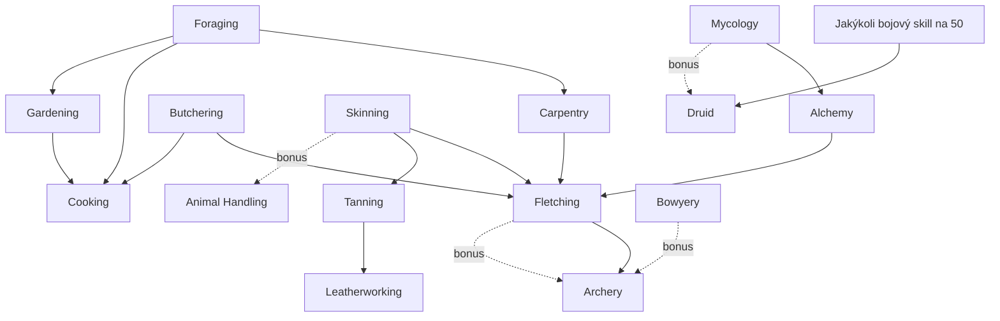

# Doporučené pořadí levelování a závislosti mezi skilly

Stav k 2026-10-08. Podrobnosti ke skillům jsou v [combat.md](combat.md) a [crafting.md](crafting.md), tady je jen pořadí, graf závislostí a obecné tipy. Reddit a oficiální fórum se nepodařilo načíst (fórum HTTP 403, Reddit zablokovaný), takže pořadí vychází z wiki a z fanouškovských průvodců. Je to návrh, ne ověřená „meta“.

## 1. Graf závislostí

Šipka „A -> B“ znamená, že A dodává materiál nebo odemyká B. Zdroje jsou u tabulky níže.

| Vztah | Co přesně | Zdroj |
|---|---|---|
| Foraging -> Carpentry | Foraging sbírá dřevo (Oak Wood a další), potřeba Handsaw | [wiki: Foraging](https://wiki.projectgorgon.com/wiki/Foraging), [wiki: Oak Wood](https://wiki.projectgorgon.com/wiki/Oak_Wood) |
| Carpentry -> Fletching | Dowely a Empty Fletching Box | [wiki: Fletching](https://wiki.projectgorgon.com/wiki/Fletching), [wiki: Carpentry](https://wiki.projectgorgon.com/wiki/Carpentry) |
| Alchemy -> Fletching | Acidic Cleansery od Fletchingu 30. Weak Acidic Cleanser se vyrábí na Alchemy 25 | [wiki: Weak Acidic Cleanser](https://wiki.projectgorgon.com/wiki/Weak_Acidic_Cleanser) |
| Butchering, Skinning -> Fletching | Femur (Advanced Arrowheads), Feathers z kuřat a krocanů při stahování, Cat Eyeball | [wiki: Fletching](https://wiki.projectgorgon.com/wiki/Fletching), [wiki: Feather](https://wiki.projectgorgon.com/wiki/Feather), [wiki: Butchering](https://wiki.projectgorgon.com/wiki/Butchering) |
| Fletching -> Archery | Šípy. Od Archery 42 jsou potřeba Expert's Arrow, které NPC neprodávají | [wiki: Expert's Arrow](https://wiki.projectgorgon.com/wiki/Expert%27s_Arrow) |
| Gardening, Butchering, Foraging -> Cooking | Zelenina, maso, ovoce | [wiki: Cooking](https://wiki.projectgorgon.com/wiki/Cooking) |
| Skinning -> Tanning -> Leatherworking | Kůže, rolls, výrobky | [wiki: Tanning](https://wiki.projectgorgon.com/wiki/Tanning) |
| Jakýkoli bojový skill 50 -> Druid | Podmínka pro oltář | [wiki: Druid](https://wiki.projectgorgon.com/wiki/Druid) |

Bonusové levely, které jeden skill dá jinému při dosažení určitého levelu. Zdroje jsou v odkazovaných stránkách skillů.

| Skill | Dává | Zdroj |
|---|---|---|
| Fletching 15, 29, 43, 75 | +1 Archery | [wiki: Fletching](https://wiki.projectgorgon.com/wiki/Fletching) |
| Fletching 25, 50 | +1 Carpentry | [wiki: Fletching](https://wiki.projectgorgon.com/wiki/Fletching) |
| Bowyery 75 | +1 Archery | [wiki: Bowyery](https://wiki.projectgorgon.com/wiki/Bowyery) |
| Skinning 15 | +1 Animal Handling | [wiki: Skinning](https://wiki.projectgorgon.com/wiki/Skinning) |
| Skinning 60 | +1 Cooking | [wiki: Skinning](https://wiki.projectgorgon.com/wiki/Skinning) |
| Butchering 20, 40 | +1 Cooking | [wiki: Butchering](https://wiki.projectgorgon.com/wiki/Butchering) |
| Mycology 10, 40 | +1 Alchemy | [wiki: Mycology](https://wiki.projectgorgon.com/wiki/Mycology) |
| Mycology 45 | +1 Druid | [wiki: Mycology](https://wiki.projectgorgon.com/wiki/Mycology) |
| Tanning 20 | +1 Skinning | [wiki: Tanning](https://wiki.projectgorgon.com/wiki/Tanning) |

Poznámka. Wiki popisuje u skillů také „synergy levels“, tedy bonusové levely, které skill dostává z jiných skillů (například Archery dostává synergii z Fletching na 15, 29, 43 a 75, Bowyery na 75, Crossbow na 25, 50 a 75, Human Anatomy na 19 a Meditation na 25 ([wiki: Archery](https://wiki.projectgorgon.com/wiki/Archery))). Odměny „+1 skill“ na stránce jednoho skillu a „synergy“ na stránce druhého jsou dvě strany téhož, ale wiki je u všech dvojic nezapisuje stejně, takže je tabulka výše neúplná.

## 2. Doporučené pořadí

Uživatel má Archery kolem 20 a Animal Handling kolem 15. Pořadí je moje sestavení z údajů na wiki. Není to citace z jednoho průvodce. U každého kroku je důvod.

### Fáze A. Teď (Archery 20 až 35)

1. Pokračovat v boji s Archery a Animal Handling. Držet rozdíl mezi nimi pod 25 levelů ([wiki: Skills](https://wiki.projectgorgon.com/wiki/Skills)).
2. Zvyšovat favor u Elahila na Comfortable a Friends. Důvody. Odemknutí Fletchingu (Comfortable, 500 councils), levnější dowely a boxy, šípy Advanced a hodinové hangouty s Archery XP ([wiki: Elahil](https://wiki.projectgorgon.com/wiki/Elahil)).
3. Vedle boje přidat Skinning a Butchering. Oba se levelují přímo na mrtvolách, které stejně zabíjíte, a dávají Feathers, Femur a maso. Nůž k Butcheringu prodává Fainor, cenu jsem nezjistil ([wiki: Skinning](https://wiki.projectgorgon.com/wiki/Skinning), [wiki: Butchering](https://wiki.projectgorgon.com/wiki/Butchering)). Skinning 15 dá +1 Animal Handling.
4. First Aid od Marny zdarma. Marnin hangout dá 200 First Aid XP ([wiki: Marna](https://wiki.projectgorgon.com/wiki/Marna)). Armor Patching učí Marna také zdarma ([wiki: Armor Patching](https://wiki.projectgorgon.com/wiki/Armor_Patching)).
5. Nakupovat šípy u Elahila místo výroby. Cena je malá (Beginner's 3, Basic 7, Advanced 15, ověřit jednotku, viz [crafting.md](crafting.md)).

### Fáze B. Fletching a Carpentry (Archery 30 až 45)

1. Carpentry. Dowely a boxy si můžete vyrábět sami z Oak Wood (Handsaw 75 councils u Therese, [wiki: Therese](https://wiki.projectgorgon.com/wiki/Therese)). Carpentry 10 (Maple Dowels), 20 (Cedar Dowels), 30 (Spruce Dowels).
2. Fletching. Udělat jednou každý recept pro bonus za první výrobu (zhruba 20 700 XP do levelu 50, odhad, viz [crafting.md](crafting.md)). Cíl je Fletching 33 před Archery 42 (Expert's Arrow).
3. Alchemy 25 kvůli Weak Acidic Cleanseru. Od Fletchingu 30 bez Alchemy nejde skoro nic vyrobit ([wiki: Fletching](https://wiki.projectgorgon.com/wiki/Fletching)). Alchemy učí například Azalak v Serbule ([wiki: Azalak](https://wiki.projectgorgon.com/wiki/Azalak)).
4. Cooking a Gardening jako vedlejší. Jídlo dává regeneraci, zeleninu dodává Gardening. Gardening má semínka od 7 councils u Therese ([wiki: Therese](https://wiki.projectgorgon.com/wiki/Therese)).

### Fáze C. Zeď na 50 (Archery 45 až 55)

Před levelem 50 si zajistit peníze. Odemknutí rozsahu 51 až 60 stojí 20 000 councils za Archery (Alravesa, Friends) a 20 000 za Animal Handling (Gisli, Close Friends) ([wiki: Alravesa](https://wiki.projectgorgon.com/wiki/Alravesa_the_All-Hunter), [wiki: Gisli](https://wiki.projectgorgon.com/wiki/Gisli)). Rozsah 61 až 70 stojí 91 000 a 100 000 councils. Fletching 51 až 60 u Bellemy stojí 20 000 ([wiki: Bellema Deftwhisper](https://wiki.projectgorgon.com/wiki/Bellema_Deftwhisper)). Zeď se tedy týká všech tří skillů. Rozumné je Fletching nad 50 nechat na později a kupovat hlavice u Elahila a Sie Antry.

V tomto okamžiku zvažte Druid (podmínka je jakýkoli bojový skill na 50) a rozhodněte podle [combat.md](combat.md).

### Fáze D. Po zdi

Druid (pokud ano), Mycology kvůli +1 Druid na 45, Foraging pro Gardening a Cooking, případně Bowyery u Denton Razora pro Tuneup Kity a +1 Archery na 75.

### Co odložit

- Tanning a Leatherworking. Wiki nezmiňuje přímou vazbu na Archery. Dává smysl až kvůli zbroji nebo penězům.
- Survival Instincts. Wiki ho popisuje jako skill jen pro zvířecí postavy ([wiki: Survival Instincts](https://wiki.projectgorgon.com/wiki/Survival_Instincts)). Pokud postava není zvíře, přeskočit.
- Endurance. Roste automaticky při boji v brnění. Archer s petem dostává málo zásahů, takže Endurance poroste pomalu (můj závěr, nepotvrzený zdrojem). Neinvestovat čas navíc.

## 3. Obecné tipy

### Favor

- Stupně favor a jejich prahy. Neutral 0, Comfortable 100, Friends 300, Close Friends 600, Best Friends 1200, Like Family 2000, Soul Mates 3000 ([wiki: Favor](https://wiki.projectgorgon.com/wiki/Favor)).
- Hlavní způsob získání jsou dárky podle toho, co NPC miluje nebo má rád (zjistíte v Small Talk), potom úkoly a hangouty. Wiki neuvádí rozpad favor v čase ([wiki: Favor](https://wiki.projectgorgon.com/wiki/Favor)). Komunitní FAQ říká, že se favor ani předměty nemají mazat (wipe), a doporučuje sled „Craft, Favor, Barter, Sell“ ([projectgorgonguide.com: faq](https://projectgorgonguide.com/doku.php?id=faq), 2026-01-12).
- Vyšší favor zvyšuje peněženku obchodníka a maximální cenu, kterou zaplatí, a odemyká trénink, storage a consignment ([wiki: Favor](https://wiki.projectgorgon.com/wiki/Favor)). Obchodník má týdenní limit, a když ho vyčerpáte, počkáte týden, nebo zvýšíte favor ([wiki: Making Money](https://wiki.projectgorgon.com/wiki/Making_Money), stránka z února 2020).
- Hangouty jsou levný zdroj XP. Příklady z wiki. Elahil dává 150 až 300 Archery XP, Gisli 250 Animal Handling XP, Marna 200 First Aid XP, Echur 50 až 450 Meditation XP ([wiki: Elahil](https://wiki.projectgorgon.com/wiki/Elahil), [wiki: Gisli](https://wiki.projectgorgon.com/wiki/Gisli), [wiki: Marna](https://wiki.projectgorgon.com/wiki/Marna), [wiki: Echur](https://wiki.projectgorgon.com/wiki/Echur)). Poslední zvolený hangout běží i po odhlášení ([wiki: Favor](https://wiki.projectgorgon.com/wiki/Favor)).

### Bonus za první výrobu

- Fletching 16 krát level, Carpentry a Cooking zhruba 4 krát běžné XP, Butchering 5 krát level, Tanning kolem čtyřnásobku. Čísla jsou ze stránek skillů ([wiki: Fletching](https://wiki.projectgorgon.com/wiki/Fletching), [wiki: Carpentry](https://wiki.projectgorgon.com/wiki/Carpentry), [wiki: Cooking](https://wiki.projectgorgon.com/wiki/Cooking), [wiki: Butchering](https://wiki.projectgorgon.com/wiki/Butchering), [wiki: Tanning](https://wiki.projectgorgon.com/wiki/Tanning)).
- Praktické pravidlo. Vyrobit jednou každý recept, který si koupíte, místo opakování nejlevnějšího ([wiki: Cooking](https://wiki.projectgorgon.com/wiki/Cooking)).
- Gourmand dává XP za každé nové jídlo, typicky 10 krát Meal Level ([wiki: Gourmand](https://wiki.projectgorgon.com/wiki/Gourmand)). Uvařené jídlo je tedy užitečné dvakrát, nejdřív jako XP z Cookingu, potom jako XP z Gourmandu.

### Jak funguje XP

- XP z killu dostanou skilly, jejichž schopnost jste použili v poslední minutě. U Armor Patching to wiki píše přímo ([wiki: Armor Patching](https://wiki.projectgorgon.com/wiki/Armor_Patching)). U ostatních bojových skillů to tvrdí starší Steam průvodce (výtah z vyhledávače, stránka vrátila HTTP 429).
- Rozdíl nad 25 levelů mezi aktivními skilly zešedne schopnosti nižšího ([wiki: Skills](https://wiki.projectgorgon.com/wiki/Skills)).
- Podle starších průvodců stačí na levely 1 až 40 několik dní, na levely 40 až 90 měsíc a nad 50 rozhoduje favor, crafting a průzkum víc než samotné grindování ([projectgorgonguide.com: skills](https://projectgorgonguide.com/doku.php?id=skills), 2026-02-21).
- Wiki pro Fletching, Foraging, Butchering a další dává XP tabulky. Například Fletching potřebuje 78 010 XP do levelu 50 (spočteno ze [wiki: Fletching](https://wiki.projectgorgon.com/wiki/Fletching)). Archery tabulku XP jsem neověřoval, TODO.
- Trenéři po levelech 50, 60 a 70 požadují peníze i favor, viz fáze C.

### Peníze pro nováčka

- Nejstarší doporučený zdroj je boj v dungeonech (Serbule Crypt) a prodej výbavy NPC v Serbule ([wiki: Making Money](https://wiki.projectgorgon.com/wiki/Making_Money), stránka z února 2020, ceny a obchodníky ověřit).
- Cooking. Zabíjet prasata a jeleny u Serbule, vařit a prodávat Fainorovi nebo hráčům (tamtéž).
- Work Orders. Merchanti vydávají zakázky na dodání předmětů. Zakázka jde splnit jednou za 30 dní na postavu a NPC ([wiki: Industry](https://wiki.projectgorgon.com/wiki/Industry)). Fitz the Boatman v Serbule má mnoho zakázek nízkého levelu. Dobře platí například Fire Dust a Oregano ([wiki: Industry](https://wiki.projectgorgon.com/wiki/Industry)). Zakázky na šípy a dowely jsou uvedeny v [crafting.md](crafting.md). Nesrovnalost mezi 20 hodinami (stránka Basic Arrow) a 30 dny (Industry) je tam také.
- Hráčské zakázky nedávají Industry XP, ale často platí nad tržní cenu ([wiki: Making Money](https://wiki.projectgorgon.com/wiki/Making_Money)).
- Cenné předměty nevyhazovat. Žaludek pro sýr, Strange Dirt pro Gardening a Empty Bottle ([wiki: Making Money](https://wiki.projectgorgon.com/wiki/Making_Money)).
- Skinning a Leatherworking. Kůže a rolls kupují někteří NPC ([wiki: Making Money](https://wiki.projectgorgon.com/wiki/Making_Money)).
- Komunitní FAQ radí v začátku neutrácet za rozšiřování inventáře a nejdřív budovat favor a peníze ([projectgorgonguide.com: faq](https://projectgorgonguide.com/doku.php?id=faq)).

## 4. Otevřené otázky

- Rasa a forma postavy. Určuje, zda jde použít Survival Instincts, a zda půjde těžit dřevo (zvířecí formy nemohou, [wiki: Carpentry](https://wiki.projectgorgon.com/wiki/Carpentry)).
- Zda je Animal Handling u Gisliho nebo u Crelpina (nesrovnalost mezi wiki a Codexem, viz [combat.md](combat.md)).
- Kolik stojí vyšší stupně Druid a Mentalism. Wiki to neuvádí nebo to označuje jako nepotvrzené.
- Zda dávka výroby je 1 000 kusů, nebo 1 kus (nesrovnalost wiki, viz [crafting.md](crafting.md)).
- Jestli luk splňuje požadavek na dřevěnou zbraň u Druida.
- Aktuální názory hráčů z Redditu a fóra po úpravách z roku 2025. K nim se nepodařilo dostat.
